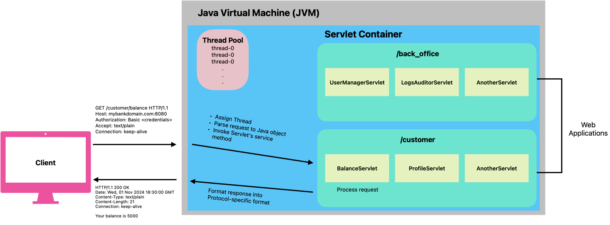
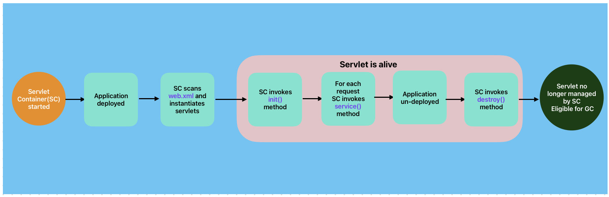
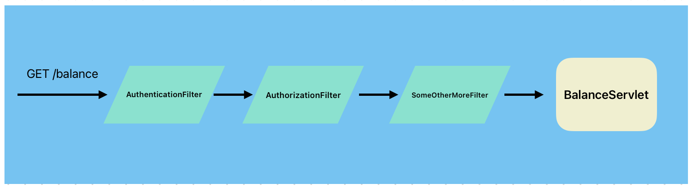
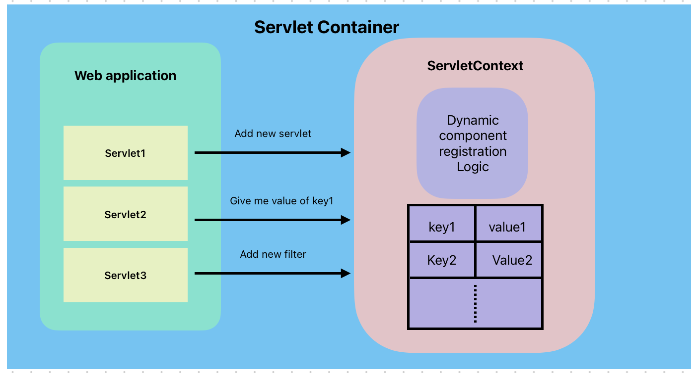
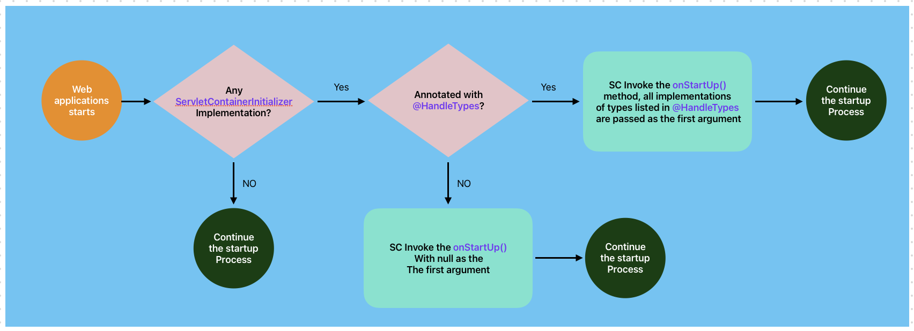

= Servlet: The Foundation of Java Web Technology
Ahmed Ali Rashid <https://github.com/ahmedjaad>
1.0, Oct 27, 2024: Detailing Servlet Tachnology
:toc: preamble
:icons: font
:git-repo-url: https://github.com/ahmedjaad/servlet-basics

* We’ve mixed XML and annotation-based configurations to broaden your understanding of
Servlet API, and for illustration purposes, not a preference for XML, modern practices
favor annotations.
* This article is accompanied by source code on {git-repo-url}[GitHub].
Following along with the code, while reading will help you better understand
the concepts discussed.

== Introduction
If you're a Spring developer like me, you've likely encountered mentions of the `DispatcherServlet` in articles or books. It’s often described as the "*Front Controller*" of the Spring MVC framework, accompanied by well-crafted diagrams explaining the concept.

But in my experience, many of these resources fail to address a crucial question:
*How does Spring MVC make the `DispatcherServlet` its Front Controller?*

Answering this question requires a solid understanding of the Servlet technology ecosystem, which forms the backbone of Spring MVC. Gaining this knowledge can elevate you from being an okay Spring Boot developer to a Spring professional with in-depth expertise.

In this article, we’ll begin by exploring the core concepts of Servlet technology.
Then, in the next parts of this series,
we’ll uncover how Spring leverages these concepts to build the powerful Spring MVC framework.

== What is a Servlet?

If you've been asked this question in an interview, I'd like to know what your answer was,
this is such a multifaceted question I myself don't know if I could give a straight answer.
Let us look at some ways one can answer this question

* Servlet is part of the suite of specifications that make up Jakarta EE. Formerly known as Java Enterprise Edition(Java EE),
it is a set of specifications that standardizes how we write Java enterprise applications,
Jakarta Servlet specifies server-side API for handling HTTP request and responses.
More commonly known specifications are Jakarta Persistence(JPA),
Jakarta Transactions(JTA) and Jakarta RESTful Web Services(JAX-RS).
* Servlet is a Java object that can handle a web request on a particular path and can give a dynamic response to it. +
An instance of a `jakarta.servlet.Servlet` implementation,
this object is registered to a Java-based web server(more to come about it) together with the path it wants to handle. +
Say you're developing a banking app,
and you want the path `/balance` to return the balance of the user, you'd do the following:
+
--
- Define a class say `Balance` that implements `jakarta.servlet.Servlet` interface, the class should handle all the business logic related to the user's balance.
- Register the `Balance` class and the path `/balance` to the Web server.
--
+
Whenever a client sends a request to the `/balance` path, the web server will handle that request to the instance of the `Balance` class.
* A servlet is the basic building block unit of a Jakarta EE web application. As simple as Servlets seem to be, they're the foundation of Java Web technologies everything else is based on them,
technologies like JSP, JSF, Spring MVC, and many more wouldn't exist without servlets.
Non-web technologies like JTA and JPA do not depend on servlets

Each of these perspectives helps paint a clearer picture of servlets and *brings* us closer to understanding Java web technology.
Before we get into the specifics of the Servlet API lets us first
clarify an important concept,
a term that most of us probably have heard it before *Servlet container*,
an important component of Jakarta EE ecosystem that a servlet object lives in.

[#_servlet_container]
== Servlet Container

Spring Boot is incredibly popular for simplifying Java web application development.
However,
one of the trade-offs of this simplicity is that it often obscures the foundational components of Java web technology.
This can make it easy for new developers to feel confident,
but when issues arise that require understanding of how things work under the hood, the challenge becomes clear.
One such component that Spring Boot abstracts away is the servlet container.
If you’ve never heard of servlet containers, or if they’re a mystery to you,
this section is for you as I’ll do my best to demystify them. +
A servlet container like Apache Tomcat and Eclipse Jetty, is a Java program, like any other Java program, an example of which the infamous "Hello World" program,
it starts by invoking the main method and runs inside the JVM. +
What makes the Servlet container a bit more special java program is that it provides the running environment and manages servlets, and it achieves this by doing at least the following things

* *_Instantiate an instance of your Servlet implementation_*
* *_Providing Servlet and JSP APIs at runtime_*: that's why you don't package your application with these APIs.
* *_Listening for HTTP requests_* from a port of your choice by default, both Tomcat and Jetty listen to port 8080.
* *_Parsing HTTP requests_*: Unmarshalling an HTTP request(plain text) into Java objects representing HTTP requests and responses, as HTTP is a plain text protocol.
* *_Invoking servlet object_*: The servlet container will spawn a thread(or using an existing one from a pool) to invoke the servlet object that matches the HTTP path and pass the corresponding Java HTTP object.
* *_Format and return the response_*: Marshalling the Java object representing the HTTP response into plain text HTTP response ready for the client to receive it.

When you think about it, a servlet container is an HTTP server,
think of it as a minified Java based HTTP server.
Emphasis on minified,
because servlet containers know
only how to run servlets and JSPs unlike full-blown application servers like Glassfish and Weblogic
that support full spectrum Jakarta EE specifications like EJB, JTA, and CDI. +

Multiple web applications can run in the same servlet container as long
as they're installed in different URL workspaces.
In our Banking system example,
we can have two web applications the customer application,
installed at `/customer` that handles all customer requests and the back office application,
installed at `/back_office` that handle requests from the Bank's employees
these two applications will be exposed
at `mybankdomain.com:port/customer`  and `mybankdomain.com:port/back_office` respectively.
At the end of this article, we talk about how to register Servlets and other components with the container

== Servlet API

Apart from Servlets themselves, other important building blocks in servlet-powered applications are Listeners and Filters.
Listeners are objects that are registered to listen to container events,
and the container will notify them whenever such events happen
while Filters are components that are meant to pre-process servlet requests and post-process servlet response.
In this section, we will also see another two components that play a crucial role in _DispatcherServlet_, that is
`ServletContext` and `ServletContainerInitializer`

=== Servlet

TIP: Usages for these methods are demonstrated in the link:../src/main/java/servlet_basics/BalanceGenericServlet.java[BalanceGenericServlet] class

The `jakarta.servlet.Servlet` is a protocol-independent interface that defines minimal specification for a servlet.
The interface defines three life-cycle methods that are invoked by the *_Servlet Container_*.

==== Servlet Lifecycle:

* `init(ServletConfig servletConfig)`: The initializing method It is called by the Servlet container just after the Servlet instance has been constructed,
a `ServletConfig` is passed to the servlet by the Servlet Container via this method,
`ServletConfig` is servlet configuration object that  contains values like servlet name, servlet initial parameters.
This method is the place where the Servlet Container  notifies the servlet that is being put into service(for handling request)
* `service(ServletRequest req, ServletResponse res)`: We have already mentioned that the servlet container will call the corresponding servlet for each request from the client
This is the method that the Servlet container calls,
and the request from the client is parsed in to `jakarta.servlet.ServletRequest` object and passed through this method.
* `destroy()`: The cleanup method, when the Servlet object is done being used,
it is taken out of service then get destroyed
by calling its `destroy()` method before being eligible to Garbage Collector(GC).
The Logic to clean up any resource that the servlet possesses should be placed in this method +

The interface also define the `ServletConfig getServletConfig()` method
which returns a `ServletConfig` which the servlet can use
to get the start-up info and the `String getServletInfo()` method
that the servlet can use to get information about itself like _version_,
_author_ and _copyright_

==== Servlet In Action: Handling Account Balance Requests

We will implement a simple servlet,`BalanceGenericServlet`,
that handles an HTTP GET request on the `/balance` URL pattern and returns random integer value as the balance.

[source,java]
.BalanceGenericServlet.java
----
    @Override
    public void service(ServletRequest req, ServletResponse res) throws ServletException, IOException {
        logger.info(MessageFormat.format("Servlet Request is {0}\n", req));
        if (!(req instanceof HttpServletRequest httpReq && res instanceof HttpServletResponse httpRes)) {
            throw new ServletException("I can only handle Http requests");
        }
        if (httpReq.getMethod().equals("GET")) {
            httpRes.setStatus(200);
            httpRes.setContentType("text/plain");
            try (PrintWriter writer = httpRes.getWriter()) {
                writer.println(MessageFormat.format("Your balance is {0}", new Random().nextInt() ));
            }
        } else httpRes.sendError(400, "http.method_not_supported");
    }
----

The `service` method first makes sure that the incoming request is an HTTP request by checking the type of `ServletRequest` and `ServletResponse`.
Throws an `Exception` if the request is not an HTTP request, remembers  `jakarta.servlet.Servlet` is protocol-independent,
which means even non-HTTP requests will be passed to the servlet. It then goes on to handle the GET request.

==== Simpler Servlet For HTTP Requests:

You probably think "that is a lot of work to handle a simple GET request". You're right,
you almost have no reason to override the `serivce` method,
the Servlet API comes with two abstract implementations of the `Servlet` interface that make you job simpler,
the protocol-independent class  `jakarta.servlet.GenericServlet` and its subclass `jakarta.servlet.HttpServlet`,
the two classes together do the following

* `GenericServlet`: Provides the no-argument, simpler overloaded version the `init(ServletConfig servletConfig)`  method.
* `HttpServlet`: Should be the superclass for all HTTP servlets,
it defines HTTP-specific methods in the form of `doXXX()` where `XXX` is the HTTP verb the method handles,
e.g `doGet()`, `doPost()`, `doPut()`...
+
IMPORTANT: Remember the Servlet Container does not call the individual Http-specific methods, it calls the `service()` method.

By extending the `HttpServlet`, writing HTTP servlets becomes way simpler.
You don't need to implement all the methods from the `Servlet` interface
and all you have to do is overriding the corresponding HTTP method.
We can now handle the `/balance` GET request as
[source,java]
.BalanceHttpServlet.java
----
    @Override
    public void doGet(HttpServletRequest req, HttpServletResponse resp) throws IOException {
        resp.setStatus(200);
        resp.setContentType("text/plain");
            try (PrintWriter writer = httpRes.getWriter()) {
                writer.println(MessageFormat.format("Your balance is {0}", new Random().nextInt()));
            }
    }

----
You can compare our two classes `servlet_basics.BalanceGenericServlet` and `servlet_basics.BalanceHttpServlet` to observe the differences

=== Filters

By default, servlet containers handle some aspects of requests and responses, such as setting cookies, managing sessions, and interpreting headers. However, this default behavior is not always sufficient. You may need to address cross-cutting concerns like authentication, logging, or request/response encryption. Filters provide a way to intercept requests and responses for pre-processing or post-processing tasks, and they can be applied to specific servlets or URL patterns.

==== When to Use Filters:

* Use filters for common concerns across multiple servlets.
* Avoid filters for concerns specific to a single servlet; place such logic directly in the servlet.

==== Filter Lifecycle:

Filters follow a well-defined lifecycle managed by the servlet container.
If filters are registered correctly and successfully,
the Servlet Container will invoke the three methods defined in the `jakarta.servlet.*_Filter_*` interface in this order
--
* `init(FilterConfig filterConfig)`: This is the place where the Servlet Container is notifying the filter that it is about to be placed in service.
This method must complete successfully in order for the `doFilter` method to be invoked.
A `FilterConfig` instance is passed to this method, implementations can opt to save this instance in a field, so information like the filter's name, filter's initial parameters can be obtained from it.
The `FilterConfig` class also contains the `getServletContext` method which returns reference to `ServletContext` instance
* `doFilter()`: This method is invoked for each request whenever the URL matches the url-pattern or the servlet names specified in the filter definition.
The method is invoked before the request reaches the servlet.
Instances of `ServletRequest` and `ServletResponse` are passed to this method, as well as an instance of `FilterChain` whose method `doFilter` must be called to propagate the call to the next filter in the chain.
Remember this method will be invoked only if the `init` method is completed successfully, there is the *_happens before relationship_* between this method and the `init` method
* `destroy()`: Is invoked after the filter has been taken out of service and before is eligible to the Garbage Collector, this method is called only once and the `doFilter` method of this instance is not called anymore after this method has been called. This method is called once all threads have exited the `doFilter` method.
--
Important to note that the `init` and `destroy` methods are called only once for each filter instance. Also, just like with `Servlet` there are two abstract implementations of the `Filter` interface `GenericFilter` and `HttpFilter`, for all HTTP-based filters should implement the `HttpFilter` class. +

==== Example: Securing the `/balance` Path

Let us leverage filters to secure the path `/balance` with HTTP basic authentication,
to do that we need a filter that would intercept the URL patterns `/balance`,
say `AuthenticationFilter` and override the `doFilter`.
The `AuthenticationFilter` must be registered to the Servlet Container
that it wants to intercept any request that matches the `/balance` URL pattern, see the <<_component_registration>> section.
[source,java]
.AuthenticationFilter.java
----
    @Override
    public void doFilter(HttpServletRequest req, HttpServletResponse res, FilterChain chain) throws IOException, ServletException {
        String authenticationHeader = req.getHeader("Authorization");
        if (authenticationHeader == null) {
            res.sendError(HttpServletResponse.SC_BAD_REQUEST, "Authorization Header must be supplied");
            return;
        }
        if (!authenticationHeader.startsWith("Basic ")) {
            res.sendError(HttpServletResponse.SC_BAD_REQUEST, "Only Basic Authorization is supported");
            return;
        }
        String[] credentials = authenticationHeader.substring(6).split(":");
        if (credentials[0].equalsIgnoreCase("user") && credentials[1].equals("password")) {
            chain.doFilter(req, res);
        } else {
            res.sendError(HttpServletResponse.SC_UNAUTHORIZED, "Wrong username/password combination");
        }
    }
----

WARNING: This is an oversimplified example of how to implement an authentication filter. It assumes the credentials are submitted as plain text, but Base64 decoding is the standard for Basic Authentication. For a production-grade implementation, ensure proper decoding and secure credential handling.

The path `/balance` is now secured,
every HTTP request must contain the `Authorization` header with the value
`Basic user:password` otherwise it will be rejected by the filter. +
A Spring developer should have a clear understanding of filters
as they're extensively used in Spring MVC and Spring Security,
in fact Spring Security has a filter with the same name as ours `AuthenticationFilter`.

=== ServletContext
`jakarta.servlet.ServletContext` is an interface for your web application to interact with the servlet container. It acts as a communication bridge between your application and the container, offering functionality such as:

* Retrieving container-specific information, like the supported Servlet API version or the context path of your web application.
* Dynamically registering servlets, filters, and listeners during application startup.
* Providing a shared storage area for servlets, filters, and listeners via context attributes (key-value pairs).

==== Context Path
The context path is the portion of the URL that uniquely identifies a web application in the container. From our example in the <<_servlet_container>> section
the value for context paths will be `cutomer` and `back_office` respectively. Each application deployed in a servlet container has its own context path.

==== Dynamic Component Registration
Since Servlet 3.0, `ServletContext` provides methods like `addServlet` and `addFilter` for programmatically adding components during startup. This allows more flexible and dynamic configurations compared to static configurations in `web.xml` or annotations.

==== Global Application Storage
ServletContext attributes serve as a global storage for your web application, accessible to all servlets, filters, and listeners within the same context. For example, you can store shared configuration data or application state:
[source,java]
----
servletContext.setAttribute("config", configObject);
Object config = servletContext.getAttribute("config");
----
In distributed web applications (marked as "distributed" in `web.xml`), each JVM maintains its own ServletContext.
Here `ServletContext` shouldn't be used as the application state as the data in the context isn't really global. +

Unlike servlets or filters, ServletContext is not something you'll frequently use in day-to-day development. However, it plays a vital role in bridging your application with the servlet container and enabling advanced features.
We will see `ServletContext` demo in conjunction with the `ServletContainerInitializer`.

=== Listeners
The Servlet specification allows developers to track key events in a servlet application's lifecycle and respond to them through listeners. Listeners are components that listen for events in the web application's lifecycle and act accordingly. When registered, the servlet container invokes the corresponding listener methods in response to specific events.

Listeners operate at three levels in a servlet application:

. Servlet Context-Level (Application-Level): Events involving the state or resources of the application-wide `ServletContext`.
. Session-Level: Events tied to individual user sessions (`HttpSession`).
. Request-Level: Events tied to individual requests (`ServletRequest`).

Each level supports two event categories:

. Lifecycle Changes: Involve events when resources are initialized or destroyed, e.g.
* `ServletContextListener`: For `ServletContext` initialization and destruction events.
* `HttpSessionListener`: For Http Session creation and destruction.
* `ServletRequestListener`: For servlet request creation and destruction.
. Attribute Changes: Events triggered by changes to attributes within these resources. Examples include:
* `ServletContextAttributeListener`: For attribute additions, removals, or replacements in `ServletContext`.
* `HttpSessionAttributeListener`: For similar changes in `HttpSession`.

==== Practical Example: Managing User Data with `HttpSessionListener`

Going back to our banking system, say we want to improve the experience of customer users
by having their personal data managed in a session so the data is available throughout the session's lifetime.
We can leverage `HttpSessionListener` by overriding the `sessionCreated` method,
the servlet container will notify us through this method when a new session is created,
below code gives us the idea how we would approach this
[source,java]
.UserDataLoader.java
----
    @Override
    public void sessionCreated(HttpSessionEvent se) {
        HttpSession session = se.getSession();
        UserData userData = getUserData();
        session.setAttribute("userData", userData); // Retrieve user data from a database or service
    }

----
NOTE: The getUserData() method represents the logic to fetch user data, typically from a database or external service.

Another example that logs `ServletContext` attributes after the `ServletContext` has been initialized is demonstrated in the `ServletContextLogger` class.

=== ServletContainerInitializer
The last interface we'll explore is `ServletContainerInitializer`. This interface allows third-party libraries to be notified during the web application startup phase through its `onStartup` method. Using this method, libraries can programmatically register servlets, filters, and listeners.

==== How Does It Work?
The servlet container discovers implementations of ServletContainerInitializer using the META-INF/services mechanism. Specifically, a file named `jakarta.servlet.ServletContainerInitializer` in the `META-INF/services` directory of a JAR contains the fully qualified name of the initializer class. During startup, the container invokes the `onStartup` method of the discovered implementations.

==== Practical Example: Centralized Security

Consider a microservices-based of our banking system requiring extra layered security.
For example:

* In the `back_office` service, all endpoints under `/admin` should only be accessible to users with the `ADMIN` authority.
* In the `customer` service, all endpoints under `/transactions` should require re-authentication.

A centralized security configuration can be implemented as a JAR containing a ServletContainerInitializer. The initializer uses a servlet context attribute (`serviceName`) to determine the service and register appropriate security filters. Here's how this might look:

[source,java]
.SecurityFilterInitializer.java
----
    @Override
    public void onStartup(Set<Class<?>> clazzes, ServletContext ctx) {
        Object serviceName = ctx.getAttribute("serviceName");
        if (serviceName.equals("back_office")) registerAdminFilter(ctx);
        if (serviceName.equals("customer")) registerTransactionFilter(ctx);
    }
----

NOTE: The `serviceName` attribute is set in the servlet context before deployment through `web.xml`. Check the class `SecurityFilterInitializer` for the full implementations. Depending on the value of the `serviceName` you can send an HTTP request that starts with either `/transactions` or `/admin` paths to see the filters in action

==== The Role of `@HandlesTypes`
An implementation of `ServletContainerInitializer` can be annotated with `@HandlesTypes.` This annotation
specifies class types (interfaces or abstract classes) the initializer can handle.
The container will pass implementations or subclasses of these types as the first argument to the `onStartup` method.
This mechanism is particularly useful for frameworks like Spring,
which uses `SpringServletContainerInitializer`
to delegate servlet context initialization to programmer-defined classes implementing `WebApplicationInitializer`. +

NOTE: If this is still somehow confusing, Check our `SecurityFilterInitializer` and `OtherSecurityInitializer` and their Javadoc to see the whole thing in action

In the next part of this series, we’ll explore how Spring MVC leverages `ServletContainerInitializer` and the `@HandlesTypes` annotation to register the `DispatcherServlet` programmatically.

[#_component_registration]
== Registering Components with the Servlet Container
When working with servlets, filters, and listeners, you need to inform the servlet container about their existence and how they should be used. This process is called component registration. Servlet containers provide two main ways to register these components:

. Declarative Registration (`web.xml` Deployment Descriptor):
The traditional way of registering servlets, filters, and listeners, is by defining them in the web.xml file. This XML file resides in the `WEB-INF` directory of your web application. For example:

+
[source,xml]
.web.xml
----
<!-- Registering a Servlet -->
<servlet>
    <servlet-name>BalanceGenericServlet</servlet-name>
    <servlet-class>servlet_basics.BalanceGenericServlet</servlet-class>
</servlet>
<servlet-mapping>
    <servlet-name>BalanceServlet</servlet-name>
    <url-pattern>/balance</url-pattern>
</servlet-mapping>

<!-- Registering a Filter -->
<filter>
    <filter-name>AuthenticationFilter</filter-name>
    <filter-class>servlet_basics.AuthenticationFilter</filter-class>
</filter>
<filter-mapping>
    <filter-name>AuthenticationFilter</filter-name>
    <url-pattern>/balance</url-pattern>
</filter-mapping>

<!-- Registering a Listener -->
<listener>
    <listener-class>servlet_basics.UserDataLoader </listener-class>
</listener>

----

. Programmatic Registration (Annotations):
Since Servlet 3.0, you can use annotations to register components directly in the source code, simplifying the process and avoiding the need for a `web.xml` file.
* Servlet Registration:
+
[source,java]
.BalanceGenericServlet.java
----
@WebServlet(name = "Balance", urlPatterns = {"/balance"})
public class BalanceGenericServlet implements Servlet {
    // Implementation
}

----

* Filter Registration:
+
[source,java]
.AuthenticationFilter.java
----
@WebFilter(filterName = "AuthenticationFilter", urlPatterns = {"/balance"})
public class AuthenticationFilter implements HttpFilter {
    // Implementation
}

----

* Listener Registration:
+
[source,java]
.UserDataLoader.java
----
@WebListener
public class UserDataLoader implements HttpSessionListener {
    // Implementation
}

----

Both methods achieve the same outcome but serve different needs. Use `web.xml` when you require centralized configuration and annotations for a more modern, streamlined approach.

By registering your components correctly, the servlet container knows how to manage them and route requests effectively within your application.

== Conclusion

In this first part of our series, we explored the foundational concepts of servlet technology.
We discussed servlets, filters, listeners, servlet containers,
and how these building blocks work together to create robust Java web applications.
However, we haven't touched on everything there is to know about the servlet technology.
Our focus has been on aspects most relevant to understanding how Spring MVC's is bootstrapped and how `DispatcherServlet` works.

If you’re eager to deepen your knowledge, we encourage you to explore the Servlet Specification and Jakarta EE further, as it offers many features and possibilities beyond what we've covered here.

In the next part of this series, we’ll dive into how Spring leverages the servlet ecosystem to bootstrap Spring MVC and make its `DispatcherServlet` a powerful front controller.

